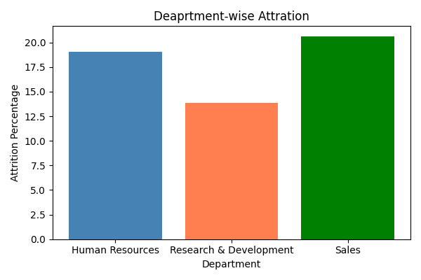
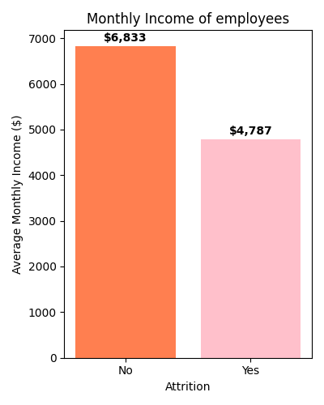

# HR Analytics — Employee Attrition Analysis 👥📊

End-to-end data cleaning and visualization project using Python and pandas.
Transformed a messy hr-analytics dataset into clean, analysable data.

## What I did
- Analysed 1,470 IBM Employees data
- built meaning full visual insights
- Extracted business insights from clean data
- Gave meaningfull business recommendation

## Key Findings
- Overall attrition rate: 16.1%
- Young employees (avg age 33.6) leave more than those who stay (avg age 37.6)
- 53.6% of employees who left were doing overtime
- Employees who left earned $2,000 less per month ($4,787 vs $6,832)
- Sales Representatives have highest attrition rate at 39.7%
- Sales department attrition rate: 20.6% — highest among all departments

## Employees who were doing Overtime and left company

## Income Analysis

## Business Recommendatoion

1. We should re check the salary amount for employees who are doing overtime
2. communicate with the young employees so that we could get to know more about why employees are leaving, and it makes better bonding
3. Talk with manger and employees under Sales representative role to know why their is higest attrition rate
   

## Project Structure

hr-analytics-attrition/
├── notebooks/
│   ├── 01_loading_and_profiling.ipynb
│   ├── 02_who_is_leaving.ipynb
│   ├── 03_why_leaving.ipynb
│   └── 04_summary_recommendations.ipynb
├── images/
└── README.md

## Tools Used
- Python, pandas, numpy, matplotlib, seaborn, Jupyter Notebook
 
